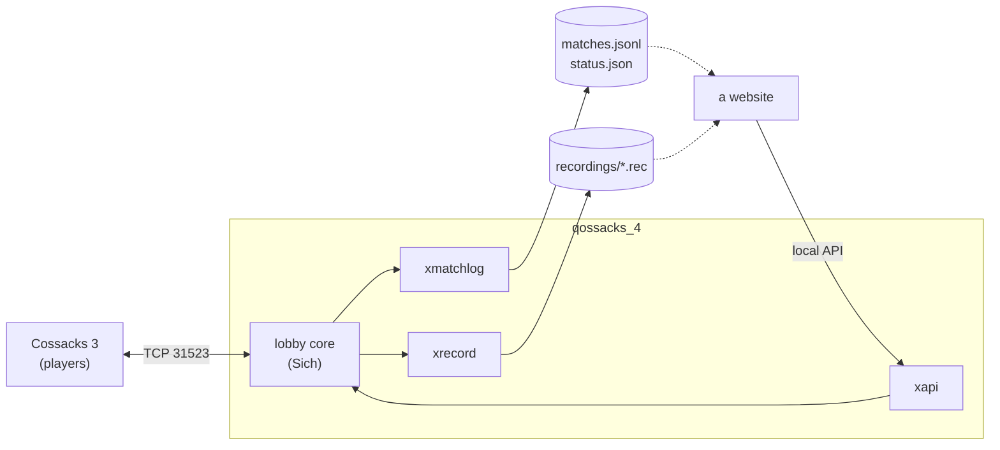

# qossacks_4

A lobby server for **Cossacks 3**: a fork of [Sich](https://github.com/3skcassoc/sich)
v0.2.9 by 3skcassoc, extended for a ladder site. It runs
[QLadder](https://qladder.com).

Everything Sich does works as before, and the players need nothing but the
stock game. Each addition is off until its option is set in `config.store`.

How it works inside, with diagrams (modules, the path of a packet, a match
and its files, accounts): [docs/architecture.md](docs/architecture.md).

| Option | What it does |
|---|---|
| `matchlog = "/path/matches.jsonl"` | Lobby and match events as JSON lines: matches with players, nations, teams and room settings; results; leavers; accounts (no passwords or cd keys). |
| `status = "/path/status.json"` | Who is online and which rooms exist, rewritten every 5 s. |
| `recordings = "/path/dir"` | Every packet of every started room, in the QLREC1 format; packets Sich cannot handle go to `unhandled_<boot>.rec`. Private messages are never recorded. |
| `api = { port = 31524, token = "<32+ characters>" }` | A local line protocol to create accounts and reset passwords from a website. Listens on 127.0.0.1 unless `api.host` says otherwise. |
| `commands = { ladder = "/path/ladder.tsv", site = "https://..." }` | Chat commands: a message that starts with `!` (lobby chat, private or room) is answered by the server and not passed on. `!help`, `!rating [nick]`, `!top`, `!online`, `!rooms`, `!last`; in a room `!odds` (chances by ladder rating) and `!balance` (the most even teams); in a match `!remake` (when every player agrees in the first `remake_minutes`, 5 by default, a `remake` event goes to the match log and the ladder does not count the match); `!pause` / `!unpause` in a match (the server follows the host's pause broadcasts, so a toggle never goes the wrong way; `pauses` a player a match, 3 by default); `!test` (how the game shows server messages). Answers come from a virtual player, QLadder (`bot = false` turns it off). The ladder data comes from a tab-separated file the website writes (see `src/xcommands.lua`); the server never waits on the network. |
| `accounts = { managed = true, message = "..." }` | Accounts and passwords come from the `api` only. Registering from the game gets error 6 ("Incorrect registration data"); a password changed in the game's profile is ignored, and the player gets `message`. |

Other changes:

- Teams come from the room datasync: the lock packet only has a lobby
  placeholder (13 for the room's creator).
- Reports of a statistics mod (LAN parser 7700) are recorded and never
  relayed to the players.
- `PING` from clients is kept as their ping time.
- The account store is written to a temporary file and renamed, so a crash
  or a full disk cannot truncate it.
- A password reminder request no longer writes the password to the log.

The protocol, the room data and the match stream these features read are
documented in [cossacks_3_net_spec](https://github.com/kewl-ua/cossacks_3_net_spec),
with a Python parser for the recordings.

The upstream instructions follow; they apply unchanged.

## Server

To run Sich you need to install Lua 5.1 and LuaSocket library:

* **Debian**: `apt-get install lua5.1 lua-socket`

* **Windows**: download and install [LuaForWindows](https://github.com/rjpcomputing/luaforwindows/releases/latest)

Next, download [sich.lua](../../raw/main/release/sich.lua).
If you want to change default options (host, port, etc.) download and edit [config.store](../../raw/main/release/config.store).

To start:

* **Debian**: `lua sich.lua`

* **Windows**: double click on file `sich.lua`

## Client

* Open `<Cossacks 3>/data/resources/servers.dat` in text editor.

* Remove or comment out official servers, add new one.

* Restart game.

## Tools

* [C3 Servers](../../raw/main/tools/c3servers.wlua)

* [Protocol Dissector for Wireshark](../../raw/main/tools/cossacks3dissector.lua)

## License

* [WTFPL](../../raw/main/LICENSE), as upstream.
