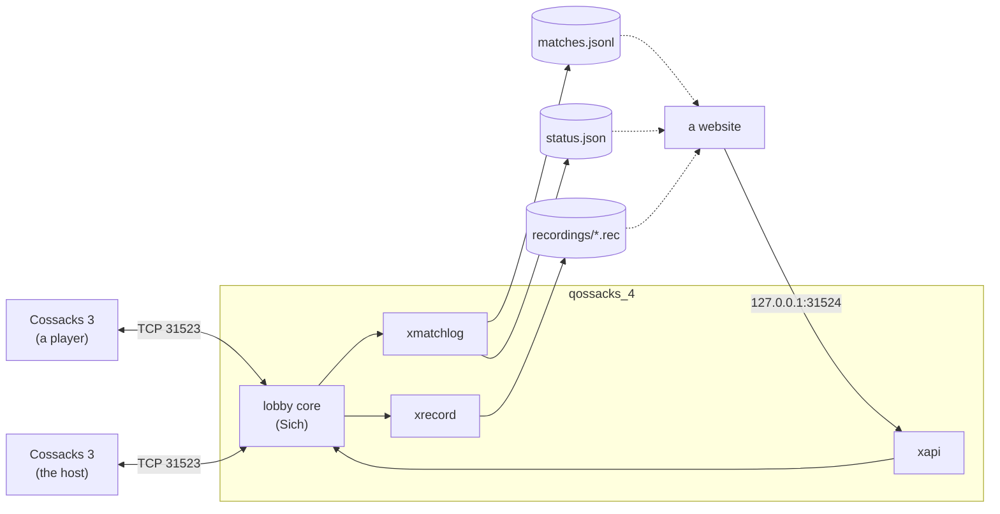
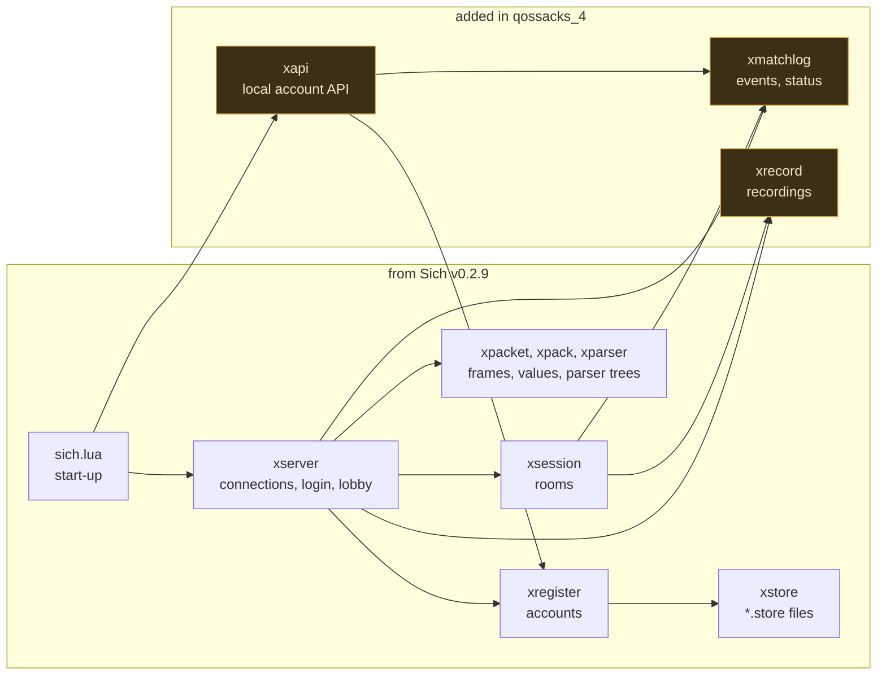
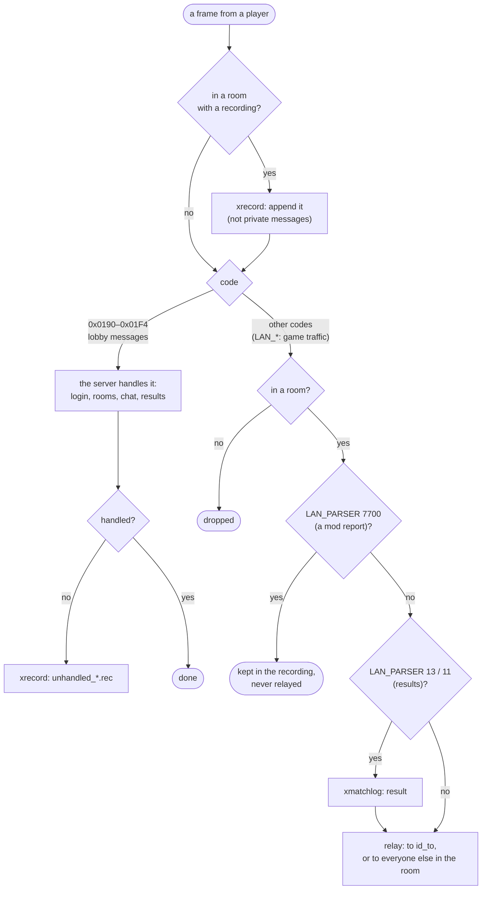
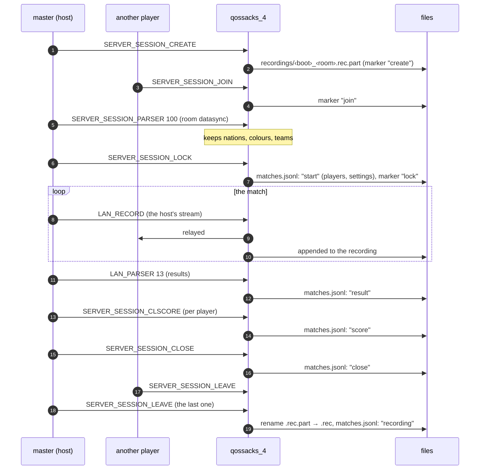
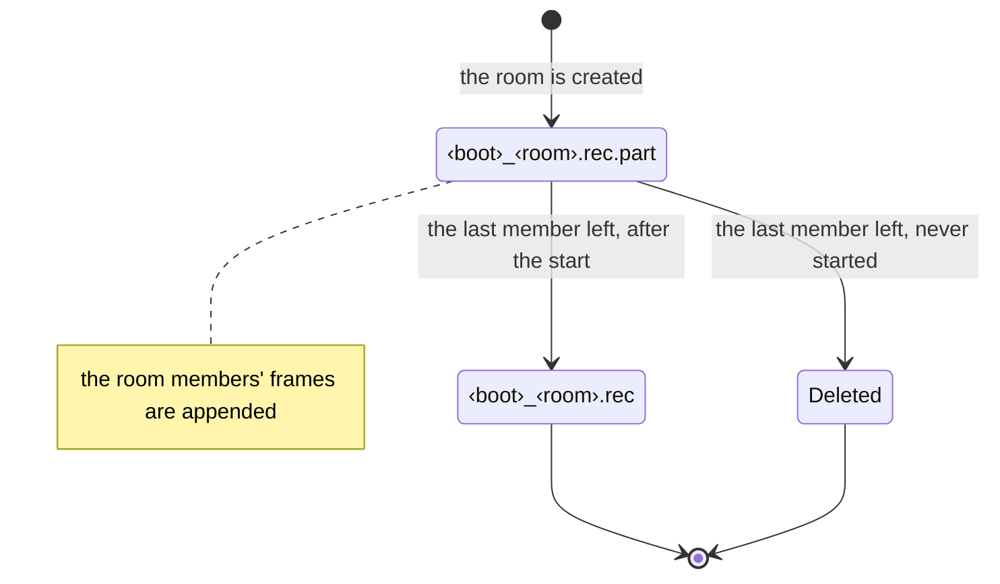
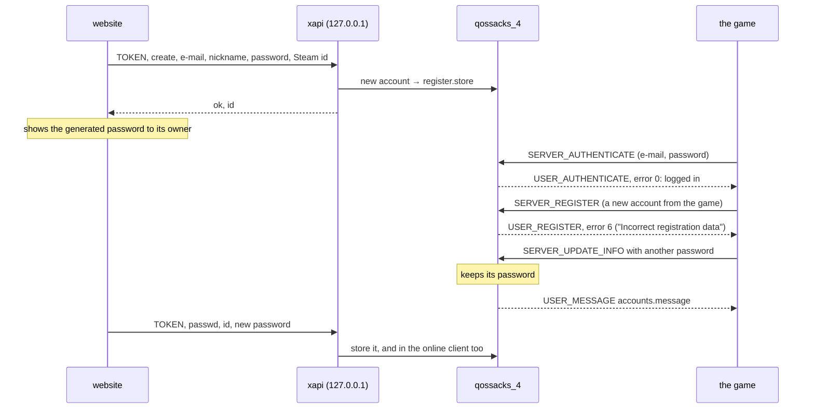
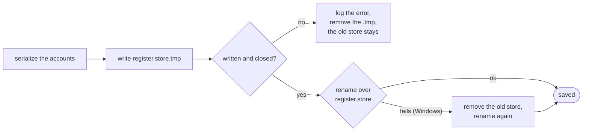

# qossacks_4 architecture

How the server is put together, what happens to a packet, and what a match
leaves behind. The protocol itself (frames, messages, the match stream) is in
[cossacks_3_net_spec](https://github.com/kewl-ua/cossacks_3_net_spec).

- [1. Overview](#1-overview)
- [2. Modules](#2-modules)
- [3. The path of a packet](#3-the-path-of-a-packet)
- [4. A match, and what it leaves behind](#4-a-match-and-what-it-leaves-behind)
- [5. Accounts](#5-accounts)
- [6. Saving the account store](#6-saving-the-account-store)
- [7. Files and events](#7-files-and-events)

## 1. Overview

- The players' games connect to the lobby core, as to any Sich server. There
  is no traffic between the players: the server relays everything in a room.
- The additions only watch and write files, except `xapi`, which a website
  on the same machine uses to create accounts and set passwords.
- Every addition is off until its option is set in `config.store`.

## 2. Modules

Not drawn: `xclient` and `xclients` (players, broadcast), `xconfig`
(`config.store`), `xsocket` (coroutines, sockets), `xlog`, and the upstream
extras `xadmin`, `xecho`, `xhard`.

Changed upstream modules:

| Module | Change |
|---|---|
| `xserver` | hooks for the log and the recorder; `PING` kept; mod reports dropped; `accounts.managed`; no password in the reminder log |
| `xsession` | hooks; the team from the room datasync |
| `xstore` | atomic save (6) |
| `sich.lua` | starts `xapi` |

## 3. The path of a packet

The match stream (`0x04B0 LAN_RECORD`) takes the relay path: the host sends
it, the server passes it to the other players and keeps a copy in the
recording.

## 4. A match, and what it leaves behind

- A player who leaves a started match is logged as `leave`. If it is the
  master, the server picks a new one and sends it `USER_SESSION_RECREATE`
  (upstream Sich): the match goes on with a new host.
- The recording of a room that never started is deleted:

## 5. Accounts

With `accounts.managed`, accounts and passwords come only from the website,
through `xapi`:

Without `accounts.managed` the game registers and changes passwords as in
Sich.

## 6. Saving the account store

A crash or a full disk in the middle of a save leaves either the old store or
the new one, never half of it. Upstream Sich rewrote the file in place.

## 7. Files and events

| Option | File | Content |
|---|---|---|
| `matchlog` | one JSON object per line | the events below |
| `status` | JSON, rewritten every 5 s | online players (with their address, not published), rooms, clients per game version |
| `recordings` | `<boot>_<room>.rec` | QLREC1: timestamped raw frames of a started room, plus JSON markers (`create`, `join`, `leave`, `lock`, `master`, `close`) |
| `recordings` | `unhandled_<boot>.rec` | frames the server could not parse or handle, same format |

`matchlog` events (`ev`):

| Event | When |
|---|---|
| `boot` | the server starts (with its version) |
| `account` | at boot for every account, on register, login and profile update (never a password or cd key) |
| `start` | a room is locked: players (nation, colour, team), the room's lobby entry and datasync, the game version |
| `result` | the host reports results (parser 13) or a surrender is confirmed (11) |
| `score` | `SERVER_SESSION_CLSCORE`: a result code per player |
| `leave` | a player leaves a started match |
| `close` | the host closes the match |
| `recording` | a recording is complete |
